# Zencode scripts used in Zenflows

Zencode is executed by the [Zenroom](http://zenroom.org) VM running inside a crypto-provider micro-service locally reachable by Zenflows.

The language documentation is found on [dev.zenroom.org](https://dev.zenroom.org).

The `src` directory contains scripts called by the running Zenflows instance.

The `test` directory contains unit tests (single scripts tested in local) and integration tests (shell scripts that call zenflows staging instances to test its api).

## Login creation

```mermaid
sequenceDiagram
autonumber
  participant U as 🤓User
  participant C as 📱Client
  participant S as Server

  S->>S: Configured with secret salt 
  C->>U: Greets, asks email, name and challenges 
  U->>C: Answers email, name
  C->>+S: Sends name and email to server (ASAP)
  S->>S: Verifies email is not a duplicate
  S->>S: Compute HMAC of email with secret salt
  S->>-C: Sends HMAC (ASAP)
  U->>C: User provides answers to challenges
  C->>C: Generate SEED with PBKDF of HASH(answers) with HMAC
  C->>S: (Optional) Generate KDF dictionary of individual answers
  C->>C: Generate public keys from SEED
  C->>S: Sends public keys
```

- 1) Secret salt is generated at server install and saved as an HEX string in its configuration
- 2) Interactive GUI poses all questions in one page: email, name and 5 challenges
- 4) As soon as User answers name and email, reactive page sends them to server (ASAP)
- 7) As soon as Client receives HMAC the Submit button is green
- 8) May happen in parallel while Client and Server are handshaking the HMAC (ASAP)
- 9) May need User confirmation that the answers given to challenges are OK
- 10) Useful to facilitate seed recovery: the server can check validity of single answers
- 12) Start with EDDSA public keys, seed is reused for more key types when needed
