# Zencode crypto in Zenflows

[](https://github.com/dyne/zenflows-crypto/actions)


Zenflows is a tool to leverage commons-based peer production by
documenting and monitoring the life cycle of products. The goal is
that of enabling a federated network of organizations to bundle,
systematize and share data, information and knowledge about physical
artifacts.

This repository contains the cryptographic functions used in Zenflows.

[](http://www.dyne.org)

------

# Repository organization

Zencode is executed by the [Zenroom](http://zenroom.org) VM running inside a crypto-provider micro-service locally reachable by Zenflows.

The language documentation is found on [dev.zenroom.org](https://dev.zenroom.org).

The `src` directory contains scripts called by the running Zenflows instance.

The `test` directory contains unit tests (single scripts tested in local) and integration tests (shell scripts that call zenflows staging instances to test its api).

# Sequence diagrams

Below are detailed the most complex crypto exchanges taking place in Zenflows.

## Login creation

```mermaid
sequenceDiagram
autonumber
  participant U as 🤓User
  participant C as 📱Client
  participant S as Server

  S->>S: Configured with secret salt 
  C->>U: Greets, asks email, name and challenges 
  U->>C: Answers email, name
  C->>+S: Sends name and email to server (ASAP)
  S->>S: Verifies email is not a duplicate
  S->>S: Compute HMAC of email with secret salt
  S->>-C: Sends HMAC (ASAP)
  U->>C: User provides answers to challenges
  C->>C: Generate SEED with PBKDF of HASH(answers) with HMAC
  C->>S: (Optional) Generate KDF dictionary of individual answers
  C->>C: Generate public keys from SEED
  C->>S: Sends public keys
```


### Zencode

- [keypairoomClient-8-9-10-11-12](src/keypairoomClient-8-9-10-11-12.ts)
- [keypairoomServer-6-7](src/keypairoomServer-6-7.zen)
- [keypairoomClientRecreateKeys](src/keypairoomClientRecreateKeys.ts)

### Notes

- 1: Secret salt is generated at server install and saved as an HEX string in its configuration
- 2: Interactive GUI poses all questions in one page: email, name and 5 challenges
- 4: As soon as User answers name and email, reactive page sends them to server (ASAP)
- 7: As soon as Client receives HMAC the Submit button is green
- 8: May happen in parallel while Client and Server are handshaking the HMAC (ASAP)
- 9: May need User confirmation that the answers given to challenges are OK
- 10: Useful to facilitate seed recovery: the server can check validity of single answers
- 12: Start with EDDSA public keys, seed is reused for more key types when needed

-----------------

## File upload

Detail of each query

### Upload Request query from Client to Server

Uploader Agent is known by the Server and Client signs this query

```
UploadRequest {
    hash: Url64!         # sha512
    name: String!
    description: String
    date: DateTime
    mimeType: String!
    extension: String!
    size: Integer!       # bytes
}
```

### Upload Window query from Server to Storage

Server is known to Storage and signs this query

The eddsa_pk is the one associated to the Client Agent who has made the Upload Request

```
UploadWindow {
	eddsa_pk: Base58!
	expiry: DateTime!  # decided by Server
	{ File:: }         # sent by Server
}
```

### Upload query from Client to Storage

The Client is unknown to storage, its public key was communicated by the Server

```
Upload {
	hash: Url64!         # header
	signature: Base58!   # header
	bin: Base64!         # multi-part body
}
```

### Stored data inside Storage

The Storage will end up saving this data associated to a hash in url

```
File {
  hash: Url64!          # sha512
  name: String!
  description: String
  date: DateTime
  uploadDate: DateTime! # Storage fills after upload
  mimeType: String!
  extension: String!
  size: Integer!        # bytes
  bin: Base64!
}
```

## Upload Sequence Diagram

Upload sequence to the File Storage service (same server or separate CDN)

```mermaid
sequenceDiagram
autonumber
  participant C as 📱Client
  participant S as 🐧Server
  participant F as 💽Storage
  C->>S: Mutate (GQL) requesting upload of File::
  S->>S: Associate uploader Agent to public key (::eddsa_pk)
  S->>F: Marks File:: plus ::eddsa_pk accepted for upload on ::expiry
  C->>F: Upload ::bin in body with ::hash ::signature in header
  F->>F: Check ::hash ::signature and ::size
  C->>F: Allow upload until ::size
  F->>F: Check matching ::hash of uploaded ::bin
  F->>C: Serve File::bin as :mime content of ::hash URI
```



### Notes

1. Clients can make signed mutations on servers containing the File field detailed above
2. Servers signs a message to Storage about hash and size as accepted for upload (expiry)
3. Clients may upload to Storage the content of File of declared size at any later time (expiry), upload is made in multi-part and header with hash is content-disposition
4. Storage checks if hash and size are accepted for upload
5. Storage may abort the upload or allow it reading data only until size
6. Storage checks hash of uploaded data
7. Storage saves the data as File::bin and serves it on HTTP GET as File::hash

The only authenticated communication happens between Client and Server and between Server and Storage, not between Client and Storage.

The Storage has the public key of the server, not that of clients, which simplifies key exchange.

Any Client may hit the upload API endpoint of Storage without signaing, verification is made on expiring key/value of hash and size.


## FabAccess communication

This section illustrates the communication protocol with the [FabAccess API](https://gitlab.com/fabinfra/fabaccess/fabaccess-api) implemented in [BFFHD](https://gitlab.com/fabinfra/fabaccess/bffh) to authenticate users and allow them to execute commands on connected Fab machines within an authenticated session.

### FabAccess Sequence Diagram

The Zenflows federated instance operates in a trustless way and leverages our W3C-DID as authentication trust anchor (client public keys).


### Notes

1. Clients may sign a request to open a FabAccess session
2. Zenflows may verify then forward the request to FabAccess
3. Fabaccess verifies the request using the PK found on DID
4. SESSION START: Fabaccess sends a session token to Zenflows
5. Zenflows forwards the session token to the Client
6. ITER: Client signs the token + a FabAccesss API request
7. ITER: Zenflows forwards to FabAccess the signed tok+API+count
8. ITER: Fabaccess verifies the signed tok+API+count and executes
9. ITER: Fabaccess describes execution / returns results
10. ITER: Results are forwarded to the Client
11. Client may request end of session
12. Zenflows signals the end of session or timeout

#### Packet schema
Now we describe the structure of packets sent from the client using the provided zencode.

#### (1) Sign Open Session
To open a session the zencode requires the signature of the current timestamp (to prevent _replay attacks_)
```
{
	"timestamp": "1234567"
}
```
The return value is a dictionary with: the command (`OPEN`), the identity, the signature and the timestamp. E.g.
```
{
  "command": "OPEN",
  "eddsa_public_key": "EdDja2UdyPPEduFhXLEzzRHuW9TdaG7g16oVFAXWYvHt",
  "eddsa_signature": "4YApLBq9KMytJZmcRUdU2Ltn6QqLiDCPWshziBJymeP88vRg63VNWL19PM8TxZjcQvkBU6g7ABmwXdCyPnzWsNjM",
  "timestamp": "1234567"
}
```

We are signing the string `"OPEN:<timestamp>"`

#### (6,11) Send command
The supported commands are `ON`, `OFF`, `CLOSE`. The `service` key descrive the resource we want to change the state of, in case of the `CLOSE` command it must be the string `"shutdown"`. E.g.
```
{
  "token": "ZmFiYWNjZXNzIHRva2Vu",
  "command": "CLOSE",
  "service": "shutdown",
  "timestamp": 1234567 
}
```
The value that will have to be sent is analogous to the previous one
```
{
  "command":"CLOSE",
  "eddsa_public_key":"BmW1a6x43P4Rae9B4hS67PhHTCUShXAGy4K8tQtUfa8L",
  "eddsa_signature":"2wCGyeAmaLmgkJPFdCEig5khWYmSeGrEHnnmMDS4Ysm62o544p1ucJUL7VXDX6ko6zae4NTFKtgyb2HrwtwkMpEr",
  "service":"shutdown",
  "timestamp":"123456",
  "token":"ZmFiYWNjZXNzIHRva2Vu"
}
```
We are signing the string `"<command>:<counter>:<token>:<service>"`

## 💼 License

    Zenflows crypto

    Copyright (c) 2021-2022 Dyne.org foundation, Amsterdam

    This program is free software: you can redistribute it and/or modify
    it under the terms of the GNU Affero General Public License as
    published by the Free Software Foundation, either version 3 of the
    License, or (at your option) any later version.

    This program is distributed in the hope that it will be useful,
    but WITHOUT ANY WARRANTY; without even the implied warranty of
    MERCHANTABILITY or FITNESS FOR A PARTICULAR PURPOSE.  See the
    GNU Affero General Public License for more details.

    You should have received a copy of the GNU Affero General Public License
    along with this program.  If not, see <http://www.gnu.org/licenses/>.

