# Zencode crypto in Zenflows

[](https://github.com/dyne/zenflows-crypto/actions)


Zenflows is a tool to leverage commons-based peer production by
documenting and monitoring the life cycle of products. The goal is
that of enabling a federated network of organizations to bundle,
systematize and share data, information and knowledge about physical
artifacts.

This repository contains the cryptographic functions used in Zenflows.

[](http://www.dyne.org)

------

# Repository organization

Zencode is executed by the [Zenroom](http://zenroom.org) VM running inside a crypto-provider micro-service locally reachable by Zenflows.

The language documentation is found on [dev.zenroom.org](https://dev.zenroom.org).

The `src` directory contains scripts called by the running Zenflows instance.

The `test` directory contains unit tests (single scripts tested in local) and integration tests (shell scripts that call zenflows staging instances to test its api).

# Sequence diagrams

Below are detailed the most complex crypto exchanges taking place in Zenflows.

## Login creation

```mermaid
sequenceDiagram
autonumber
  participant U as 🤓User
  participant C as 📱Client
  participant S as Server

  S->>S: Configured with secret salt 
  C->>U: Greets, asks email, name and challenges 
  U->>C: Answers email, name
  C->>+S: Sends name and email to server (ASAP)
  S->>S: Verifies email is not a duplicate
  S->>S: Compute HMAC of email with secret salt
  S->>-C: Sends HMAC (ASAP)
  U->>C: User provides answers to challenges
  C->>C: Generate SEED with PBKDF of HASH(answers) with HMAC
  C->>S: (Optional) Generate KDF dictionary of individual answers
  C->>C: Generate public keys from SEED
  C->>S: Sends public keys
```


### Zencode

- [keypairoomClient-8-9-10-11-12](src/keypairoomClient-8-9-10-11-12.ts)
- [keypairoomServer-6-7](src/keypairoomServer-6-7.zen)
- [keypairoomClientRecreateKeys](src/keypairoomClientRecreateKeys.ts)

### Notes

- 1: Secret salt is generated at server install and saved as an HEX string in its configuration
- 2: Interactive GUI poses all questions in one page: email, name and 5 challenges
- 4: As soon as User answers name and email, reactive page sends them to server (ASAP)
- 7: As soon as Client receives HMAC the Submit button is green
- 8: May happen in parallel while Client and Server are handshaking the HMAC (ASAP)
- 9: May need User confirmation that the answers given to challenges are OK
- 10: Useful to facilitate seed recovery: the server can check validity of single answers
- 12: Start with EDDSA public keys, seed is reused for more key types when needed

-----------------

## File upload

File field (GraphQL)

```
type File {
  hash: Base64!        # sha512
  name: String!
  description: String!
  date: DateTime!
  mimeType: String!
  extension: String!
  size: Integer!
  uploader: Agent!
  signature: String!
  width: Integer
  height: Integer
  bin: Base64          # uploaded async
}
```

Upload sequence to the File Storage service (same server or separate CDN)

```mermaid
sequenceDiagram
autonumber
  participant C as 📱Client
  participant S as 🐧Server
  participant F as 💽Storage
  C->>+S: GQL Mutation with File ::hash and ::size, no bin
  S->>-S: Saves ::hash and ::size as accepting ::bin
  C->>F: Try to upload ::bin with ::hash and ::size in headers
  F->>S: Check if ::hash and ::size exist and has no ::bin
  F->>C: Allows upload until verified ::size
  F->>F: Check matching ::hash of uploaded ::bin
  F->>C: Saves and makes available File::bin as content of ::hash
```


1. Clients can make mutations on servers containing the File field detailed above
2. Servers saves new mutations (no bin, only hash and size) into a special table
3. Clients may try to upload to Storage the content of File at any later time
4. Storage contacts Server to check if hash and size exist and are not yet uploaded
5. Storage may abort the upload or allow it reading data only until size
6. Storage checks hash of uploaded data
7. Storage saves the data as File::bin and serves it on HTTP GET as File::hash


## 💼 License

    Zenflows crypto

    Copyright (c) 2021-2022 Dyne.org foundation, Amsterdam

    This program is free software: you can redistribute it and/or modify
    it under the terms of the GNU Affero General Public License as
    published by the Free Software Foundation, either version 3 of the
    License, or (at your option) any later version.

    This program is distributed in the hope that it will be useful,
    but WITHOUT ANY WARRANTY; without even the implied warranty of
    MERCHANTABILITY or FITNESS FOR A PARTICULAR PURPOSE.  See the
    GNU Affero General Public License for more details.

    You should have received a copy of the GNU Affero General Public License
    along with this program.  If not, see <http://www.gnu.org/licenses/>.

